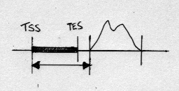
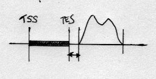

Usage
=====

Basic usage
***********

The simplest form of usage is::

    RnaChipIntegrator.py FEATURES PEAKS

where ``FEATURES`` and ``PEAKS`` are tab-delimited files containing
the genomic feature and peak data respecitively.

This will produce two output files:

 - ``FEATURES_features_to_peaks.txt``: reports the nearest genomic
   features for each peak
 - ``FEATURES_peaks_to_features.txt``: reports the nearest peaks
   for each feature

In both cases the files will contain one peak/feature pair per line.

Distance cutoffs and maximum numbers of pairs
*********************************************

The ``--cutoff`` option specifies a maximum distance that a
feature/peak pair can be apart and still be included in the results;
the ``--number`` option sets the maximum number of pairs that will
be reported for each peak or feature.

Distance to TSS versus 'feature edges'
**************************************

By default the distance between a peak and a feature is calculated
as the distance from the feature TSS to the nearest peak edge, for
example:

Alternatively distances can be calculated as the shortest distance
between either of the peak edges to either the TSS or the TES of
the feature, by specifying the ``--edge=both`` option::

    RnaChipIntegrator.py --edge=both FEATURES PEAKS

For example for the same arrangement as above this would generate a
much smaller closest distance:

.. note::

   Using ``--edge=both`` essentially makes the analyses
   'strand-agnostic'.

.. _using_differential_expression_data:

Using differential expression data
**********************************

If the input feature data contains a differential expression flag
then this can be used in the analysis by turning on the ``--only-DE``
option::

    RnaChipIntegrator.py --only-DE FEATURES PEAKS

which will only consider the flagged features in the analyses.
